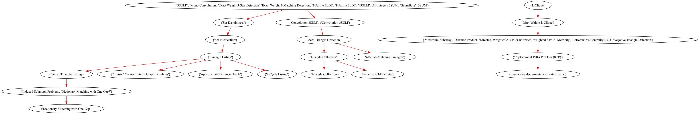
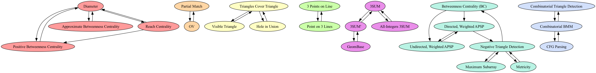

# Fine-grained analysis

## Source nodes in the SCC DAG
    - (OV, Partial Match)
    - (All-Integers 3SUM, 3SUM, 3SUM', GeomBase)
    - (Combinatorial BMM, CFG Parsing, Combinatorial Triangle Detection)
    - CNF-SAT
    - UOV
    - Matrix Product
    - Negative Triangle Search
    - Negative Triangle Listing
    - Minimum Witness Finding
    - All Pairs Minimum Witness (APMW)
    - Minimum Weight Triangle
    - Nondecreasing Triangle
    - $(\\min, \\leq)$ Product
    - Directed Radius
    - Undirected Radius
    - Directed Median
    - Undirected Median
    - Triangle Detection
    - MAX-CNF-SAT
    - OuMv
    - Triangle Collection*
    - k-Clique
    - k-SAT
    - Maximum Inner Product Search

## Longest shortest paths in the SCC DAG

## Highest impact edges
### SCCs from the original graph

### Best new edge By largest SCC (Largest SCC: 12 | # of SCCs: 6)

### Best new edge By number of SCC (Largest SCC: 6 | # of SCCs: 6)

### Table of all new edges impact by the size of the Largest SCC 

| Size of the Largest SCC | From | To | Graph |
| --- | --- | --- | --- |
| 12 | Reach Centrality | k-Clique | <a href="12 = Reach Centrality -> k-Clique.png">Graph</a> |
| 12 | Diameter | k-Clique |  |
| 12 | Positive Betweenness Centrality | k-Clique |  |
| 12 | Approximate Betweenness Centrality | k-Clique |  |
| 11 | Reach Centrality | Matrix Product |  |
| 11 | Reach Centrality | Negative Triangle Search |  |
| 11 | Reach Centrality | Negative Triangle Listing |  |
| 11 | Reach Centrality | Minimum Witness Finding |  |
| 11 | Reach Centrality | All Pairs Minimum Witness (APMW) | .png>) |
| 11 | Reach Centrality | Directed Radius |  |
| 11 | Reach Centrality | Undirected Radius |  |
| 11 | Reach Centrality | Directed Median |  |
| 11 | Reach Centrality | Undirected Median |  |
| 11 | Reach Centrality | Max-Weight k-Clique |  |
| 11 | Diameter | Matrix Product |  |
| 11 | Diameter | Negative Triangle Search |  |
| 11 | Diameter | Negative Triangle Listing |  |
| 11 | Diameter | Minimum Witness Finding |  |
| 11 | Diameter | All Pairs Minimum Witness (APMW) | .png>) |
| 11 | Diameter | Directed Radius |  |
| 11 | Diameter | Undirected Radius |  |
| 11 | Diameter | Directed Median |  |
| 11 | Diameter | Undirected Median |  |
| 11 | Diameter | Max-Weight k-Clique |  |
| 11 | Positive Betweenness Centrality | Matrix Product |  |
| 11 | Positive Betweenness Centrality | Negative Triangle Search |  |
| 11 | Positive Betweenness Centrality | Negative Triangle Listing |  |
| 11 | Positive Betweenness Centrality | Minimum Witness Finding |  |
| 11 | Positive Betweenness Centrality | All Pairs Minimum Witness (APMW) | .png>) |
| 11 | Positive Betweenness Centrality | Directed Radius |  |
| 11 | Positive Betweenness Centrality | Undirected Radius |  |
| 11 | Positive Betweenness Centrality | Directed Median |  |
| 11 | Positive Betweenness Centrality | Undirected Median |  |
| 11 | Positive Betweenness Centrality | Max-Weight k-Clique |  |
| 11 | Approximate Betweenness Centrality | Matrix Product |  |
| 11 | Approximate Betweenness Centrality | Negative Triangle Search |  |
| 11 | Approximate Betweenness Centrality | Negative Triangle Listing |  |
| 11 | Approximate Betweenness Centrality | Minimum Witness Finding |  |
| 11 | Approximate Betweenness Centrality | All Pairs Minimum Witness (APMW) | .png>) |
| 11 | Approximate Betweenness Centrality | Directed Radius |  |
| 11 | Approximate Betweenness Centrality | Undirected Radius |  |
| 11 | Approximate Betweenness Centrality | Directed Median |  |
| 11 | Approximate Betweenness Centrality | Undirected Median |  |
| 11 | Approximate Betweenness Centrality | Max-Weight k-Clique |  |
| 10 | Second Shortest Simple Path | k-Clique |  |
| 10 | Reach Centrality | Directed, Weighted APSP |  |
| 10 | Reach Centrality | Negative Triangle Detection |  |
| 10 | Reach Centrality | Maximum Subarray |  |
| 10 | Reach Centrality | Undirected, Weighted APSP |  |
| 10 | Reach Centrality | Metricity |  |
| 10 | Reach Centrality | Betweenness Centrality (BC) | .png>) |
| 10 | Diameter | Directed, Weighted APSP |  |
| 10 | Diameter | Negative Triangle Detection |  |
| 10 | Diameter | Maximum Subarray |  |
| 10 | Diameter | Undirected, Weighted APSP |  |
| 10 | Diameter | Metricity |  |
| 10 | Diameter | Betweenness Centrality (BC) | .png>) |
| 10 | Positive Betweenness Centrality | Directed, Weighted APSP |  |
| 10 | Positive Betweenness Centrality | Negative Triangle Detection |  |
| 10 | Positive Betweenness Centrality | Maximum Subarray |  |
| 10 | Positive Betweenness Centrality | Undirected, Weighted APSP |  |
| 10 | Positive Betweenness Centrality | Metricity |  |
| 10 | Positive Betweenness Centrality | Betweenness Centrality (BC) | .png>) |
| 10 | Approximate Betweenness Centrality | Directed, Weighted APSP |  |
| 10 | Approximate Betweenness Centrality | Negative Triangle Detection |  |
| 10 | Approximate Betweenness Centrality | Maximum Subarray |  |
| 10 | Approximate Betweenness Centrality | Undirected, Weighted APSP |  |
| 10 | Approximate Betweenness Centrality | Metricity |  |
| 10 | Approximate Betweenness Centrality | Betweenness Centrality (BC) | .png>) |
| 10 | 1-sensitive decremental st-shortest paths | k-Clique |  |
| 9 | Triangle Measure | 3SUM |  |
| 9 | Triangle Measure | 3SUM' |  |
| 9 | Triangle Measure | GeomBase |  |
| 9 | Triangle Measure | All-Integers 3SUM |  |
| 9 | 3D Motion Planning | 3SUM |  |
| 9 | 3D Motion Planning | 3SUM' |  |
| 9 | 3D Motion Planning | GeomBase |  |
| 9 | 3D Motion Planning | All-Integers 3SUM |  |
| 9 | Matrix Product Verification | k-Clique |  |
| 9 | Distance Product | k-Clique |  |
| 9 | Shortest Cycle | k-Clique |  |
| 9 | Second Shortest Simple Path | Matrix Product |  |
| 9 | Second Shortest Simple Path | Negative Triangle Search |  |
| 9 | Second Shortest Simple Path | Negative Triangle Listing |  |
| 9 | Second Shortest Simple Path | Minimum Witness Finding |  |
| 9 | Second Shortest Simple Path | All Pairs Minimum Witness (APMW) | .png>) |
| 9 | Second Shortest Simple Path | Directed Radius |  |
| 9 | Second Shortest Simple Path | Undirected Radius |  |
| 9 | Second Shortest Simple Path | Directed Median |  |
| 9 | Second Shortest Simple Path | Undirected Median |  |
| 9 | Second Shortest Simple Path | Max-Weight k-Clique |  |
| 9 | Replacement Paths Problem (RPP) | k-Clique |  -\> k-Clique.png>) |
| 9 | Price Query | k-Clique |  |
| 9 | Radius | k-Clique |  |
| 9 | Median | k-Clique |  |
| 9 | All-Nodes Median Parity | k-Clique |  |
| 9 | All-Nodes Positive Betweenness Centrality | k-Clique |  |
| 9 | Directed All-Nodes Positive Betweenness Centrality | k-Clique |  |
| 9 | Undirected All-Nodes Positive Betweenness Centrality | k-Clique |  |
| 9 | Directed All-Nodes Reach Centrality | k-Clique |  |
| 9 | Undirected All-Nodes Reach Centrality | k-Clique |  |
| 9 | Dynamic Bipartite Maximum-Weight Matching | k-Clique |  |
| 9 | Dynamic $st$-Shortest Path | k-Clique |  |
| 9 | 1-sensitive decremental st-shortest paths | Matrix Product |  |
| 9 | 1-sensitive decremental st-shortest paths | Negative Triangle Search |  |
| 9 | 1-sensitive decremental st-shortest paths | Negative Triangle Listing |  |
| 9 | 1-sensitive decremental st-shortest paths | Minimum Witness Finding |  |
| 9 | 1-sensitive decremental st-shortest paths | All Pairs Minimum Witness (APMW) | .png>) |
| 9 | 1-sensitive decremental st-shortest paths | Directed Radius |  |
| 9 | 1-sensitive decremental st-shortest paths | Undirected Radius |  |
| 9 | 1-sensitive decremental st-shortest paths | Directed Median |  |
| 9 | 1-sensitive decremental st-shortest paths | Undirected Median |  |
| 9 | 1-sensitive decremental st-shortest paths | Max-Weight k-Clique |  |
| 9 | 2-sensitive decremental st-shortest paths | k-Clique |  |
| 9 | 1-sensitive decremental diameter | k-Clique |  |
| 9 | 2D Maximum Subarray | k-Clique |  |
| 8 | Triangles Cover Triangle | 3SUM |  |
| 8 | Triangles Cover Triangle | 3SUM' |  |
| 8 | Triangles Cover Triangle | GeomBase |  |
| 8 | Triangles Cover Triangle | All-Integers 3SUM |  |
| 8 | Hole in Union | 3SUM |  |
| 8 | Hole in Union | 3SUM' |  |
| 8 | Hole in Union | GeomBase |  |
| 8 | Hole in Union | All-Integers 3SUM |  |
| 8 | Visible Triangle | 3SUM |  |
| 8 | Visible Triangle | 3SUM' |  |
| 8 | Visible Triangle | GeomBase |  |
| 8 | Visible Triangle | All-Integers 3SUM |  |
| 8 | Directed, Weighted APSP | k-Clique |  |
| 8 | Negative Triangle Detection | k-Clique |  |
| 8 | Matrix Product Verification | Matrix Product |  |
| 8 | Matrix Product Verification | Negative Triangle Search |  |
| 8 | Matrix Product Verification | Negative Triangle Listing |  |
| 8 | Matrix Product Verification | Minimum Witness Finding |  |
| 8 | Matrix Product Verification | All Pairs Minimum Witness (APMW) | .png>) |
| 8 | Matrix Product Verification | Directed Radius |  |
| 8 | Matrix Product Verification | Undirected Radius |  |
| 8 | Matrix Product Verification | Directed Median |  |
| 8 | Matrix Product Verification | Undirected Median |  |
| 8 | Matrix Product Verification | Max-Weight k-Clique |  |
| 8 | Maximum Subarray | k-Clique |  |
| 8 | Distance Product | Matrix Product |  |
| 8 | Distance Product | Negative Triangle Search |  |
| 8 | Distance Product | Negative Triangle Listing |  |
| 8 | Distance Product | Minimum Witness Finding |  |
| 8 | Distance Product | All Pairs Minimum Witness (APMW) | .png>) |
| 8 | Distance Product | Directed Radius |  |
| 8 | Distance Product | Undirected Radius |  |
| 8 | Distance Product | Directed Median |  |
| 8 | Distance Product | Undirected Median |  |
| 8 | Distance Product | Max-Weight k-Clique |  |
| 8 | Undirected, Weighted APSP | k-Clique |  |
| 8 | Metricity | k-Clique |  |
| 8 | Shortest Cycle | Matrix Product |  |
| 8 | Shortest Cycle | Negative Triangle Search |  |
| 8 | Shortest Cycle | Negative Triangle Listing |  |
| 8 | Shortest Cycle | Minimum Witness Finding |  |
| 8 | Shortest Cycle | All Pairs Minimum Witness (APMW) | .png>) |
| 8 | Shortest Cycle | Directed Radius |  |
| 8 | Shortest Cycle | Undirected Radius |  |
| 8 | Shortest Cycle | Directed Median |  |
| 8 | Shortest Cycle | Undirected Median |  |
| 8 | Shortest Cycle | Max-Weight k-Clique |  |
| 8 | Second Shortest Simple Path | Directed, Weighted APSP |  |
| 8 | Second Shortest Simple Path | Negative Triangle Detection |  |
| 8 | Second Shortest Simple Path | Maximum Subarray |  |
| 8 | Second Shortest Simple Path | Undirected, Weighted APSP |  |
| 8 | Second Shortest Simple Path | Metricity |  |
| 8 | Second Shortest Simple Path | Betweenness Centrality (BC) | .png>) |
| 8 | Replacement Paths Problem (RPP) | Matrix Product |  -\> Matrix Product.png>) |
| 8 | Replacement Paths Problem (RPP) | Negative Triangle Search |  -\> Negative Triangle Search.png>) |
| 8 | Replacement Paths Problem (RPP) | Negative Triangle Listing |  -\> Negative Triangle Listing.png>) |
| 8 | Replacement Paths Problem (RPP) | Minimum Witness Finding |  -\> Minimum Witness Finding.png>) |
| 8 | Replacement Paths Problem (RPP) | All Pairs Minimum Witness (APMW) |  -\> All Pairs Minimum Witness (APMW).png>) |
| 8 | Replacement Paths Problem (RPP) | Directed Radius |  -\> Directed Radius.png>) |
| 8 | Replacement Paths Problem (RPP) | Undirected Radius |  -\> Undirected Radius.png>) |
| 8 | Replacement Paths Problem (RPP) | Directed Median |  -\> Directed Median.png>) |
| 8 | Replacement Paths Problem (RPP) | Undirected Median |  -\> Undirected Median.png>) |
| 8 | Replacement Paths Problem (RPP) | Max-Weight k-Clique |  -\> Max-Weight k-Clique.png>) |
| 8 | Price Query | Matrix Product |  |
| 8 | Price Query | Negative Triangle Search |  |
| 8 | Price Query | Negative Triangle Listing |  |
| 8 | Price Query | Minimum Witness Finding |  |
| 8 | Price Query | All Pairs Minimum Witness (APMW) | .png>) |
| 8 | Price Query | Directed Radius |  |
| 8 | Price Query | Undirected Radius |  |
| 8 | Price Query | Directed Median |  |
| 8 | Price Query | Undirected Median |  |
| 8 | Price Query | Max-Weight k-Clique |  |
| 8 | Betweenness Centrality (BC) | k-Clique |  -\> k-Clique.png>) |
| 8 | Radius | Matrix Product |  |
| 8 | Radius | Negative Triangle Search |  |
| 8 | Radius | Negative Triangle Listing |  |
| 8 | Radius | Minimum Witness Finding |  |
| 8 | Radius | All Pairs Minimum Witness (APMW) | .png>) |
| 8 | Radius | Directed Radius |  |
| 8 | Radius | Undirected Radius |  |
| 8 | Radius | Directed Median |  |
| 8 | Radius | Undirected Median |  |
| 8 | Radius | Max-Weight k-Clique |  |
| 8 | Median | Matrix Product |  |
| 8 | Median | Negative Triangle Search |  |
| 8 | Median | Negative Triangle Listing |  |
| 8 | Median | Minimum Witness Finding |  |
| 8 | Median | All Pairs Minimum Witness (APMW) | .png>) |
| 8 | Median | Directed Radius |  |
| 8 | Median | Undirected Radius |  |
| 8 | Median | Directed Median |  |
| 8 | Median | Undirected Median |  |
| 8 | Median | Max-Weight k-Clique |  |
| 8 | All-Nodes Median Parity | Matrix Product |  |
| 8 | All-Nodes Median Parity | Negative Triangle Search |  |
| 8 | All-Nodes Median Parity | Negative Triangle Listing |  |
| 8 | All-Nodes Median Parity | Minimum Witness Finding |  |
| 8 | All-Nodes Median Parity | All Pairs Minimum Witness (APMW) | .png>) |
| 8 | All-Nodes Median Parity | Directed Radius |  |
| 8 | All-Nodes Median Parity | Undirected Radius |  |
| 8 | All-Nodes Median Parity | Directed Median |  |
| 8 | All-Nodes Median Parity | Undirected Median |  |
| 8 | All-Nodes Median Parity | Max-Weight k-Clique |  |
| 8 | All-Nodes Positive Betweenness Centrality | Matrix Product |  |
| 8 | All-Nodes Positive Betweenness Centrality | Negative Triangle Search |  |
| 8 | All-Nodes Positive Betweenness Centrality | Negative Triangle Listing |  |
| 8 | All-Nodes Positive Betweenness Centrality | Minimum Witness Finding |  |
| 8 | All-Nodes Positive Betweenness Centrality | All Pairs Minimum Witness (APMW) | .png>) |
| 8 | All-Nodes Positive Betweenness Centrality | Directed Radius |  |
| 8 | All-Nodes Positive Betweenness Centrality | Undirected Radius |  |
| 8 | All-Nodes Positive Betweenness Centrality | Directed Median |  |
| 8 | All-Nodes Positive Betweenness Centrality | Undirected Median |  |
| 8 | All-Nodes Positive Betweenness Centrality | Max-Weight k-Clique |  |
| 8 | Directed All-Nodes Positive Betweenness Centrality | Matrix Product |  |
| 8 | Directed All-Nodes Positive Betweenness Centrality | Negative Triangle Search |  |
| 8 | Directed All-Nodes Positive Betweenness Centrality | Negative Triangle Listing |  |
| 8 | Directed All-Nodes Positive Betweenness Centrality | Minimum Witness Finding |  |
| 8 | Directed All-Nodes Positive Betweenness Centrality | All Pairs Minimum Witness (APMW) | .png>) |
| 8 | Directed All-Nodes Positive Betweenness Centrality | Directed Radius |  |
| 8 | Directed All-Nodes Positive Betweenness Centrality | Undirected Radius |  |
| 8 | Directed All-Nodes Positive Betweenness Centrality | Directed Median |  |
| 8 | Directed All-Nodes Positive Betweenness Centrality | Undirected Median |  |
| 8 | Directed All-Nodes Positive Betweenness Centrality | Max-Weight k-Clique |  |
| 8 | Undirected All-Nodes Positive Betweenness Centrality | Matrix Product |  |
| 8 | Undirected All-Nodes Positive Betweenness Centrality | Negative Triangle Search |  |
| 8 | Undirected All-Nodes Positive Betweenness Centrality | Negative Triangle Listing |  |
| 8 | Undirected All-Nodes Positive Betweenness Centrality | Minimum Witness Finding |  |
| 8 | Undirected All-Nodes Positive Betweenness Centrality | All Pairs Minimum Witness (APMW) | .png>) |
| 8 | Undirected All-Nodes Positive Betweenness Centrality | Directed Radius |  |
| 8 | Undirected All-Nodes Positive Betweenness Centrality | Undirected Radius |  |
| 8 | Undirected All-Nodes Positive Betweenness Centrality | Directed Median |  |
| 8 | Undirected All-Nodes Positive Betweenness Centrality | Undirected Median |  |
| 8 | Undirected All-Nodes Positive Betweenness Centrality | Max-Weight k-Clique |  |
| 8 | Directed All-Nodes Reach Centrality | Matrix Product |  |
| 8 | Directed All-Nodes Reach Centrality | Negative Triangle Search |  |
| 8 | Directed All-Nodes Reach Centrality | Negative Triangle Listing |  |
| 8 | Directed All-Nodes Reach Centrality | Minimum Witness Finding |  |
| 8 | Directed All-Nodes Reach Centrality | All Pairs Minimum Witness (APMW) | .png>) |
| 8 | Directed All-Nodes Reach Centrality | Directed Radius |  |
| 8 | Directed All-Nodes Reach Centrality | Undirected Radius |  |
| 8 | Directed All-Nodes Reach Centrality | Directed Median |  |
| 8 | Directed All-Nodes Reach Centrality | Undirected Median |  |
| 8 | Directed All-Nodes Reach Centrality | Max-Weight k-Clique |  |
| 8 | Undirected All-Nodes Reach Centrality | Matrix Product |  |
| 8 | Undirected All-Nodes Reach Centrality | Negative Triangle Search |  |
| 8 | Undirected All-Nodes Reach Centrality | Negative Triangle Listing |  |
| 8 | Undirected All-Nodes Reach Centrality | Minimum Witness Finding |  |
| 8 | Undirected All-Nodes Reach Centrality | All Pairs Minimum Witness (APMW) | .png>) |
| 8 | Undirected All-Nodes Reach Centrality | Directed Radius |  |
| 8 | Undirected All-Nodes Reach Centrality | Undirected Radius |  |
| 8 | Undirected All-Nodes Reach Centrality | Directed Median |  |
| 8 | Undirected All-Nodes Reach Centrality | Undirected Median |  |
| 8 | Undirected All-Nodes Reach Centrality | Max-Weight k-Clique |  |
| 8 | Dynamic Bipartite Maximum-Weight Matching | Matrix Product |  |
| 8 | Dynamic Bipartite Maximum-Weight Matching | Negative Triangle Search |  |
| 8 | Dynamic Bipartite Maximum-Weight Matching | Negative Triangle Listing |  |
| 8 | Dynamic Bipartite Maximum-Weight Matching | Minimum Witness Finding |  |
| 8 | Dynamic Bipartite Maximum-Weight Matching | All Pairs Minimum Witness (APMW) | .png>) |
| 8 | Dynamic Bipartite Maximum-Weight Matching | Directed Radius |  |
| 8 | Dynamic Bipartite Maximum-Weight Matching | Undirected Radius |  |
| 8 | Dynamic Bipartite Maximum-Weight Matching | Directed Median |  |
| 8 | Dynamic Bipartite Maximum-Weight Matching | Undirected Median |  |
| 8 | Dynamic Bipartite Maximum-Weight Matching | Max-Weight k-Clique |  |
| 8 | Dynamic $st$-Shortest Path | Matrix Product |  |
| 8 | Dynamic $st$-Shortest Path | Negative Triangle Search |  |
| 8 | Dynamic $st$-Shortest Path | Negative Triangle Listing |  |
| 8 | Dynamic $st$-Shortest Path | Minimum Witness Finding |  |
| 8 | Dynamic $st$-Shortest Path | All Pairs Minimum Witness (APMW) | .png>) |
| 8 | Dynamic $st$-Shortest Path | Directed Radius |  |
| 8 | Dynamic $st$-Shortest Path | Undirected Radius |  |
| 8 | Dynamic $st$-Shortest Path | Directed Median |  |
| 8 | Dynamic $st$-Shortest Path | Undirected Median |  |
| 8 | Dynamic $st$-Shortest Path | Max-Weight k-Clique |  |
| 8 | 1-sensitive decremental st-shortest paths | Directed, Weighted APSP |  |
| 8 | 1-sensitive decremental st-shortest paths | Negative Triangle Detection |  |
| 8 | 1-sensitive decremental st-shortest paths | Maximum Subarray |  |
| 8 | 1-sensitive decremental st-shortest paths | Undirected, Weighted APSP |  |
| 8 | 1-sensitive decremental st-shortest paths | Metricity |  |
| 8 | 1-sensitive decremental st-shortest paths | Betweenness Centrality (BC) | .png>) |
| 8 | 2-sensitive decremental st-shortest paths | Matrix Product |  |
| 8 | 2-sensitive decremental st-shortest paths | Negative Triangle Search |  |
| 8 | 2-sensitive decremental st-shortest paths | Negative Triangle Listing |  |
| 8 | 2-sensitive decremental st-shortest paths | Minimum Witness Finding |  |
| 8 | 2-sensitive decremental st-shortest paths | All Pairs Minimum Witness (APMW) | .png>) |
| 8 | 2-sensitive decremental st-shortest paths | Directed Radius |  |
| 8 | 2-sensitive decremental st-shortest paths | Undirected Radius |  |
| 8 | 2-sensitive decremental st-shortest paths | Directed Median |  |
| 8 | 2-sensitive decremental st-shortest paths | Undirected Median |  |
| 8 | 2-sensitive decremental st-shortest paths | Max-Weight k-Clique |  |
| 8 | 1-sensitive decremental diameter | Matrix Product |  |
| 8 | 1-sensitive decremental diameter | Negative Triangle Search |  |
| 8 | 1-sensitive decremental diameter | Negative Triangle Listing |  |
| 8 | 1-sensitive decremental diameter | Minimum Witness Finding |  |
| 8 | 1-sensitive decremental diameter | All Pairs Minimum Witness (APMW) | .png>) |
| 8 | 1-sensitive decremental diameter | Directed Radius |  |
| 8 | 1-sensitive decremental diameter | Undirected Radius |  |
| 8 | 1-sensitive decremental diameter | Directed Median |  |
| 8 | 1-sensitive decremental diameter | Undirected Median |  |
| 8 | 1-sensitive decremental diameter | Max-Weight k-Clique |  |
| 8 | 2D Maximum Subarray | Matrix Product |  |
| 8 | 2D Maximum Subarray | Negative Triangle Search |  |
| 8 | 2D Maximum Subarray | Negative Triangle Listing |  |
| 8 | 2D Maximum Subarray | Minimum Witness Finding |  |
| 8 | 2D Maximum Subarray | All Pairs Minimum Witness (APMW) | .png>) |
| 8 | 2D Maximum Subarray | Directed Radius |  |
| 8 | 2D Maximum Subarray | Undirected Radius |  |
| 8 | 2D Maximum Subarray | Directed Median |  |
| 8 | 2D Maximum Subarray | Undirected Median |  |
| 8 | 2D Maximum Subarray | Max-Weight k-Clique |  |
| 7 | Directed, Weighted APSP | Matrix Product |  |
| 7 | Directed, Weighted APSP | Negative Triangle Search |  |
| 7 | Directed, Weighted APSP | Negative Triangle Listing |  |
| 7 | Directed, Weighted APSP | Minimum Witness Finding |  |
| 7 | Directed, Weighted APSP | All Pairs Minimum Witness (APMW) | .png>) |
| 7 | Directed, Weighted APSP | Directed Radius |  |
| 7 | Directed, Weighted APSP | Undirected Radius |  |
| 7 | Directed, Weighted APSP | Directed Median |  |
| 7 | Directed, Weighted APSP | Undirected Median |  |
| 7 | Directed, Weighted APSP | Max-Weight k-Clique |  |
| 7 | Negative Triangle Detection | Matrix Product |  |
| 7 | Negative Triangle Detection | Negative Triangle Search |  |
| 7 | Negative Triangle Detection | Negative Triangle Listing |  |
| 7 | Negative Triangle Detection | Minimum Witness Finding |  |
| 7 | Negative Triangle Detection | All Pairs Minimum Witness (APMW) | .png>) |
| 7 | Negative Triangle Detection | Directed Radius |  |
| 7 | Negative Triangle Detection | Undirected Radius |  |
| 7 | Negative Triangle Detection | Directed Median |  |
| 7 | Negative Triangle Detection | Undirected Median |  |
| 7 | Negative Triangle Detection | Max-Weight k-Clique |  |
| 7 | Matrix Product Verification | Directed, Weighted APSP |  |
| 7 | Matrix Product Verification | Negative Triangle Detection |  |
| 7 | Matrix Product Verification | Maximum Subarray |  |
| 7 | Matrix Product Verification | Undirected, Weighted APSP |  |
| 7 | Matrix Product Verification | Metricity |  |
| 7 | Matrix Product Verification | Betweenness Centrality (BC) | .png>) |
| 7 | Maximum Subarray | Matrix Product |  |
| 7 | Maximum Subarray | Negative Triangle Search |  |
| 7 | Maximum Subarray | Negative Triangle Listing |  |
| 7 | Maximum Subarray | Minimum Witness Finding |  |
| 7 | Maximum Subarray | All Pairs Minimum Witness (APMW) | .png>) |
| 7 | Maximum Subarray | Directed Radius |  |
| 7 | Maximum Subarray | Undirected Radius |  |
| 7 | Maximum Subarray | Directed Median |  |
| 7 | Maximum Subarray | Undirected Median |  |
| 7 | Maximum Subarray | Max-Weight k-Clique |  |
| 7 | Distance Product | Directed, Weighted APSP |  |
| 7 | Distance Product | Negative Triangle Detection |  |
| 7 | Distance Product | Maximum Subarray |  |
| 7 | Distance Product | Undirected, Weighted APSP |  |
| 7 | Distance Product | Metricity |  |
| 7 | Distance Product | Betweenness Centrality (BC) | .png>) |
| 7 | Undirected, Weighted APSP | Matrix Product |  |
| 7 | Undirected, Weighted APSP | Negative Triangle Search |  |
| 7 | Undirected, Weighted APSP | Negative Triangle Listing |  |
| 7 | Undirected, Weighted APSP | Minimum Witness Finding |  |
| 7 | Undirected, Weighted APSP | All Pairs Minimum Witness (APMW) | .png>) |
| 7 | Undirected, Weighted APSP | Directed Radius |  |
| 7 | Undirected, Weighted APSP | Undirected Radius |  |
| 7 | Undirected, Weighted APSP | Directed Median |  |
| 7 | Undirected, Weighted APSP | Undirected Median |  |
| 7 | Undirected, Weighted APSP | Max-Weight k-Clique |  |
| 7 | Metricity | Matrix Product |  |
| 7 | Metricity | Negative Triangle Search |  |
| 7 | Metricity | Negative Triangle Listing |  |
| 7 | Metricity | Minimum Witness Finding |  |
| 7 | Metricity | All Pairs Minimum Witness (APMW) | .png>) |
| 7 | Metricity | Directed Radius |  |
| 7 | Metricity | Undirected Radius |  |
| 7 | Metricity | Directed Median |  |
| 7 | Metricity | Undirected Median |  |
| 7 | Metricity | Max-Weight k-Clique |  |
| 7 | Shortest Cycle | Directed, Weighted APSP |  |
| 7 | Shortest Cycle | Negative Triangle Detection |  |
| 7 | Shortest Cycle | Maximum Subarray |  |
| 7 | Shortest Cycle | Undirected, Weighted APSP |  |
| 7 | Shortest Cycle | Metricity |  |
| 7 | Shortest Cycle | Betweenness Centrality (BC) | .png>) |
| 7 | Replacement Paths Problem (RPP) | Directed, Weighted APSP |  -\> Directed, Weighted APSP.png>) |
| 7 | Replacement Paths Problem (RPP) | Negative Triangle Detection |  -\> Negative Triangle Detection.png>) |
| 7 | Replacement Paths Problem (RPP) | Maximum Subarray |  -\> Maximum Subarray.png>) |
| 7 | Replacement Paths Problem (RPP) | Undirected, Weighted APSP |  -\> Undirected, Weighted APSP.png>) |
| 7 | Replacement Paths Problem (RPP) | Metricity |  -\> Metricity.png>) |
| 7 | Replacement Paths Problem (RPP) | Betweenness Centrality (BC) |  -\> Betweenness Centrality (BC).png>) |
| 7 | Price Query | Directed, Weighted APSP |  |
| 7 | Price Query | Negative Triangle Detection |  |
| 7 | Price Query | Maximum Subarray |  |
| 7 | Price Query | Undirected, Weighted APSP |  |
| 7 | Price Query | Metricity |  |
| 7 | Price Query | Betweenness Centrality (BC) | .png>) |
| 7 | Betweenness Centrality (BC) | Matrix Product |  -\> Matrix Product.png>) |
| 7 | Betweenness Centrality (BC) | Negative Triangle Search |  -\> Negative Triangle Search.png>) |
| 7 | Betweenness Centrality (BC) | Negative Triangle Listing |  -\> Negative Triangle Listing.png>) |
| 7 | Betweenness Centrality (BC) | Minimum Witness Finding |  -\> Minimum Witness Finding.png>) |
| 7 | Betweenness Centrality (BC) | All Pairs Minimum Witness (APMW) |  -\> All Pairs Minimum Witness (APMW).png>) |
| 7 | Betweenness Centrality (BC) | Directed Radius |  -\> Directed Radius.png>) |
| 7 | Betweenness Centrality (BC) | Undirected Radius |  -\> Undirected Radius.png>) |
| 7 | Betweenness Centrality (BC) | Directed Median |  -\> Directed Median.png>) |
| 7 | Betweenness Centrality (BC) | Undirected Median |  -\> Undirected Median.png>) |
| 7 | Betweenness Centrality (BC) | Max-Weight k-Clique |  -\> Max-Weight k-Clique.png>) |
| 7 | Radius | Directed, Weighted APSP |  |
| 7 | Radius | Negative Triangle Detection |  |
| 7 | Radius | Maximum Subarray |  |
| 7 | Radius | Undirected, Weighted APSP |  |
| 7 | Radius | Metricity |  |
| 7 | Radius | Betweenness Centrality (BC) | .png>) |
| 7 | Median | Directed, Weighted APSP |  |
| 7 | Median | Negative Triangle Detection |  |
| 7 | Median | Maximum Subarray |  |
| 7 | Median | Undirected, Weighted APSP |  |
| 7 | Median | Metricity |  |
| 7 | Median | Betweenness Centrality (BC) | .png>) |
| 7 | All-Nodes Median Parity | Directed, Weighted APSP |  |
| 7 | All-Nodes Median Parity | Negative Triangle Detection |  |
| 7 | All-Nodes Median Parity | Maximum Subarray |  |
| 7 | All-Nodes Median Parity | Undirected, Weighted APSP |  |
| 7 | All-Nodes Median Parity | Metricity |  |
| 7 | All-Nodes Median Parity | Betweenness Centrality (BC) | .png>) |
| 7 | All-Nodes Positive Betweenness Centrality | Directed, Weighted APSP |  |
| 7 | All-Nodes Positive Betweenness Centrality | Negative Triangle Detection |  |
| 7 | All-Nodes Positive Betweenness Centrality | Maximum Subarray |  |
| 7 | All-Nodes Positive Betweenness Centrality | Undirected, Weighted APSP |  |
| 7 | All-Nodes Positive Betweenness Centrality | Metricity |  |
| 7 | All-Nodes Positive Betweenness Centrality | Betweenness Centrality (BC) | .png>) |
| 7 | Directed All-Nodes Positive Betweenness Centrality | Directed, Weighted APSP |  |
| 7 | Directed All-Nodes Positive Betweenness Centrality | Negative Triangle Detection |  |
| 7 | Directed All-Nodes Positive Betweenness Centrality | Maximum Subarray |  |
| 7 | Directed All-Nodes Positive Betweenness Centrality | Undirected, Weighted APSP |  |
| 7 | Directed All-Nodes Positive Betweenness Centrality | Metricity |  |
| 7 | Directed All-Nodes Positive Betweenness Centrality | Betweenness Centrality (BC) | .png>) |
| 7 | Undirected All-Nodes Positive Betweenness Centrality | Directed, Weighted APSP |  |
| 7 | Undirected All-Nodes Positive Betweenness Centrality | Negative Triangle Detection |  |
| 7 | Undirected All-Nodes Positive Betweenness Centrality | Maximum Subarray |  |
| 7 | Undirected All-Nodes Positive Betweenness Centrality | Undirected, Weighted APSP |  |
| 7 | Undirected All-Nodes Positive Betweenness Centrality | Metricity |  |
| 7 | Undirected All-Nodes Positive Betweenness Centrality | Betweenness Centrality (BC) | .png>) |
| 7 | Directed All-Nodes Reach Centrality | Directed, Weighted APSP |  |
| 7 | Directed All-Nodes Reach Centrality | Negative Triangle Detection |  |
| 7 | Directed All-Nodes Reach Centrality | Maximum Subarray |  |
| 7 | Directed All-Nodes Reach Centrality | Undirected, Weighted APSP |  |
| 7 | Directed All-Nodes Reach Centrality | Metricity |  |
| 7 | Directed All-Nodes Reach Centrality | Betweenness Centrality (BC) | .png>) |
| 7 | Undirected All-Nodes Reach Centrality | Directed, Weighted APSP |  |
| 7 | Undirected All-Nodes Reach Centrality | Negative Triangle Detection |  |
| 7 | Undirected All-Nodes Reach Centrality | Maximum Subarray |  |
| 7 | Undirected All-Nodes Reach Centrality | Undirected, Weighted APSP |  |
| 7 | Undirected All-Nodes Reach Centrality | Metricity |  |
| 7 | Undirected All-Nodes Reach Centrality | Betweenness Centrality (BC) | .png>) |
| 7 | Dynamic Bipartite Maximum-Weight Matching | Directed, Weighted APSP |  |
| 7 | Dynamic Bipartite Maximum-Weight Matching | Negative Triangle Detection |  |
| 7 | Dynamic Bipartite Maximum-Weight Matching | Maximum Subarray |  |
| 7 | Dynamic Bipartite Maximum-Weight Matching | Undirected, Weighted APSP |  |
| 7 | Dynamic Bipartite Maximum-Weight Matching | Metricity |  |
| 7 | Dynamic Bipartite Maximum-Weight Matching | Betweenness Centrality (BC) | .png>) |
| 7 | Dynamic $st$-Shortest Path | Directed, Weighted APSP |  |
| 7 | Dynamic $st$-Shortest Path | Negative Triangle Detection |  |
| 7 | Dynamic $st$-Shortest Path | Maximum Subarray |  |
| 7 | Dynamic $st$-Shortest Path | Undirected, Weighted APSP |  |
| 7 | Dynamic $st$-Shortest Path | Metricity |  |
| 7 | Dynamic $st$-Shortest Path | Betweenness Centrality (BC) | .png>) |
| 7 | 2-sensitive decremental st-shortest paths | Directed, Weighted APSP |  |
| 7 | 2-sensitive decremental st-shortest paths | Negative Triangle Detection |  |
| 7 | 2-sensitive decremental st-shortest paths | Maximum Subarray |  |
| 7 | 2-sensitive decremental st-shortest paths | Undirected, Weighted APSP |  |
| 7 | 2-sensitive decremental st-shortest paths | Metricity |  |
| 7 | 2-sensitive decremental st-shortest paths | Betweenness Centrality (BC) | .png>) |
| 7 | 1-sensitive decremental diameter | Directed, Weighted APSP |  |
| 7 | 1-sensitive decremental diameter | Negative Triangle Detection |  |
| 7 | 1-sensitive decremental diameter | Maximum Subarray |  |
| 7 | 1-sensitive decremental diameter | Undirected, Weighted APSP |  |
| 7 | 1-sensitive decremental diameter | Metricity |  |
| 7 | 1-sensitive decremental diameter | Betweenness Centrality (BC) | .png>) |
| 7 | 2D Maximum Subarray | Directed, Weighted APSP |  |
| 7 | 2D Maximum Subarray | Negative Triangle Detection |  |
| 7 | 2D Maximum Subarray | Maximum Subarray |  |
| 7 | 2D Maximum Subarray | Undirected, Weighted APSP |  |
| 7 | 2D Maximum Subarray | Metricity |  |
| 7 | 2D Maximum Subarray | Betweenness Centrality (BC) | .png>) |
<>:5: SyntaxWarning: invalid escape sequence '\>'
<>:5: SyntaxWarning: invalid escape sequence '\>'
/var/folders/6k/rf2_mhpd7790drjk7smpzn2r0000gn/T/ipykernel_3140/1608622247.py:5: SyntaxWarning: invalid escape sequence '\>'
  print(f'| {i["size"]} | {i["from"]} | {i["to"]} |  |')

### Table of all new edges impact by the number of SCCs

| Number of SCCs | From | To | Graph |
| --- | --- | --- | --- |
| 6 | 3 Points on Line | 3SUM | [graph](<impactful_edges_by_num_sccs/6 = 3 Points on Line -\> 3SUM.png>) |
| 6 | 3 Points on Line | 3SUM' | [graph](<impactful_edges_by_num_sccs/6 = 3 Points on Line -\> 3SUM'.png>) |
| 6 | 3 Points on Line | GeomBase | [graph](<impactful_edges_by_num_sccs/6 = 3 Points on Line -\> GeomBase.png>) |
| 6 | 3 Points on Line | All-Integers 3SUM | [graph](<impactful_edges_by_num_sccs/6 = 3 Points on Line -\> All-Integers 3SUM.png>) |
| 6 | Point on 3 Lines | 3SUM | [graph](<impactful_edges_by_num_sccs/6 = Point on 3 Lines -\> 3SUM.png>) |
| 6 | Point on 3 Lines | 3SUM' | [graph](<impactful_edges_by_num_sccs/6 = Point on 3 Lines -\> 3SUM'.png>) |
| 6 | Point on 3 Lines | GeomBase | [graph](<impactful_edges_by_num_sccs/6 = Point on 3 Lines -\> GeomBase.png>) |
| 6 | Point on 3 Lines | All-Integers 3SUM | [graph](<impactful_edges_by_num_sccs/6 = Point on 3 Lines -\> All-Integers 3SUM.png>) |
| 6 | Triangles Cover Triangle | 3SUM | [graph](<impactful_edges_by_num_sccs/6 = Triangles Cover Triangle -\> 3SUM.png>) |
| 6 | Triangles Cover Triangle | 3SUM' | [graph](<impactful_edges_by_num_sccs/6 = Triangles Cover Triangle -\> 3SUM'.png>) |
| 6 | Triangles Cover Triangle | GeomBase | [graph](<impactful_edges_by_num_sccs/6 = Triangles Cover Triangle -\> GeomBase.png>) |
| 6 | Triangles Cover Triangle | All-Integers 3SUM | [graph](<impactful_edges_by_num_sccs/6 = Triangles Cover Triangle -\> All-Integers 3SUM.png>) |
| 6 | Hole in Union | 3SUM | [graph](<impactful_edges_by_num_sccs/6 = Hole in Union -\> 3SUM.png>) |
| 6 | Hole in Union | 3SUM' | [graph](<impactful_edges_by_num_sccs/6 = Hole in Union -\> 3SUM'.png>) |
| 6 | Hole in Union | GeomBase | [graph](<impactful_edges_by_num_sccs/6 = Hole in Union -\> GeomBase.png>) |
| 6 | Hole in Union | All-Integers 3SUM | [graph](<impactful_edges_by_num_sccs/6 = Hole in Union -\> All-Integers 3SUM.png>) |
| 6 | Triangle Measure | 3SUM | [graph](<impactful_edges_by_num_sccs/6 = Triangle Measure -\> 3SUM.png>) |
| 6 | Triangle Measure | 3SUM' | [graph](<impactful_edges_by_num_sccs/6 = Triangle Measure -\> 3SUM'.png>) |
| 6 | Triangle Measure | GeomBase | [graph](<impactful_edges_by_num_sccs/6 = Triangle Measure -\> GeomBase.png>) |
| 6 | Triangle Measure | All-Integers 3SUM | [graph](<impactful_edges_by_num_sccs/6 = Triangle Measure -\> All-Integers 3SUM.png>) |
| 6 | Visible Triangle | 3SUM | [graph](<impactful_edges_by_num_sccs/6 = Visible Triangle -\> 3SUM.png>) |
| 6 | Visible Triangle | 3SUM' | [graph](<impactful_edges_by_num_sccs/6 = Visible Triangle -\> 3SUM'.png>) |
| 6 | Visible Triangle | GeomBase | [graph](<impactful_edges_by_num_sccs/6 = Visible Triangle -\> GeomBase.png>) |
| 6 | Visible Triangle | All-Integers 3SUM | [graph](<impactful_edges_by_num_sccs/6 = Visible Triangle -\> All-Integers 3SUM.png>) |
| 6 | 3D Motion Planning | 3SUM | [graph](<impactful_edges_by_num_sccs/6 = 3D Motion Planning -\> 3SUM.png>) |
| 6 | 3D Motion Planning | 3SUM' | [graph](<impactful_edges_by_num_sccs/6 = 3D Motion Planning -\> 3SUM'.png>) |
| 6 | 3D Motion Planning | GeomBase | [graph](<impactful_edges_by_num_sccs/6 = 3D Motion Planning -\> GeomBase.png>) |
| 6 | 3D Motion Planning | All-Integers 3SUM | [graph](<impactful_edges_by_num_sccs/6 = 3D Motion Planning -\> All-Integers 3SUM.png>) |
| 6 | Reach Centrality | Directed, Weighted APSP | [graph](<impactful_edges_by_num_sccs/6 = Reach Centrality -\> Directed, Weighted APSP.png>) |
| 6 | Reach Centrality | Negative Triangle Detection | [graph](<impactful_edges_by_num_sccs/6 = Reach Centrality -\> Negative Triangle Detection.png>) |
| 6 | Reach Centrality | Matrix Product | [graph](<impactful_edges_by_num_sccs/6 = Reach Centrality -\> Matrix Product.png>) |
| 6 | Reach Centrality | Negative Triangle Search | [graph](<impactful_edges_by_num_sccs/6 = Reach Centrality -\> Negative Triangle Search.png>) |
| 6 | Reach Centrality | Negative Triangle Listing | [graph](<impactful_edges_by_num_sccs/6 = Reach Centrality -\> Negative Triangle Listing.png>) |
| 6 | Reach Centrality | Maximum Subarray | [graph](<impactful_edges_by_num_sccs/6 = Reach Centrality -\> Maximum Subarray.png>) |
| 6 | Reach Centrality | Minimum Witness Finding | [graph](<impactful_edges_by_num_sccs/6 = Reach Centrality -\> Minimum Witness Finding.png>) |
| 6 | Reach Centrality | All Pairs Minimum Witness (APMW) | [graph](<impactful_edges_by_num_sccs/6 = Reach Centrality -\> All Pairs Minimum Witness (APMW).png>) |
| 6 | Reach Centrality | Undirected, Weighted APSP | [graph](<impactful_edges_by_num_sccs/6 = Reach Centrality -\> Undirected, Weighted APSP.png>) |
| 6 | Reach Centrality | Metricity | [graph](<impactful_edges_by_num_sccs/6 = Reach Centrality -\> Metricity.png>) |
| 6 | Reach Centrality | Directed Radius | [graph](<impactful_edges_by_num_sccs/6 = Reach Centrality -\> Directed Radius.png>) |
| 6 | Reach Centrality | Undirected Radius | [graph](<impactful_edges_by_num_sccs/6 = Reach Centrality -\> Undirected Radius.png>) |
| 6 | Reach Centrality | Directed Median | [graph](<impactful_edges_by_num_sccs/6 = Reach Centrality -\> Directed Median.png>) |
| 6 | Reach Centrality | Undirected Median | [graph](<impactful_edges_by_num_sccs/6 = Reach Centrality -\> Undirected Median.png>) |
| 6 | Reach Centrality | Betweenness Centrality (BC) | [graph](<impactful_edges_by_num_sccs/6 = Reach Centrality -\> Betweenness Centrality (BC).png>) |
| 6 | Reach Centrality | k-Clique | [graph](<impactful_edges_by_num_sccs/6 = Reach Centrality -\> k-Clique.png>) |
| 6 | Reach Centrality | Max-Weight k-Clique | [graph](<impactful_edges_by_num_sccs/6 = Reach Centrality -\> Max-Weight k-Clique.png>) |
| 6 | Diameter | Directed, Weighted APSP | [graph](<impactful_edges_by_num_sccs/6 = Diameter -\> Directed, Weighted APSP.png>) |
| 6 | Diameter | Negative Triangle Detection | [graph](<impactful_edges_by_num_sccs/6 = Diameter -\> Negative Triangle Detection.png>) |
| 6 | Diameter | Matrix Product | [graph](<impactful_edges_by_num_sccs/6 = Diameter -\> Matrix Product.png>) |
| 6 | Diameter | Negative Triangle Search | [graph](<impactful_edges_by_num_sccs/6 = Diameter -\> Negative Triangle Search.png>) |
| 6 | Diameter | Negative Triangle Listing | [graph](<impactful_edges_by_num_sccs/6 = Diameter -\> Negative Triangle Listing.png>) |
| 6 | Diameter | Maximum Subarray | [graph](<impactful_edges_by_num_sccs/6 = Diameter -\> Maximum Subarray.png>) |
| 6 | Diameter | Minimum Witness Finding | [graph](<impactful_edges_by_num_sccs/6 = Diameter -\> Minimum Witness Finding.png>) |
| 6 | Diameter | All Pairs Minimum Witness (APMW) | [graph](<impactful_edges_by_num_sccs/6 = Diameter -\> All Pairs Minimum Witness (APMW).png>) |
| 6 | Diameter | Undirected, Weighted APSP | [graph](<impactful_edges_by_num_sccs/6 = Diameter -\> Undirected, Weighted APSP.png>) |
| 6 | Diameter | Metricity | [graph](<impactful_edges_by_num_sccs/6 = Diameter -\> Metricity.png>) |
| 6 | Diameter | Directed Radius | [graph](<impactful_edges_by_num_sccs/6 = Diameter -\> Directed Radius.png>) |
| 6 | Diameter | Undirected Radius | [graph](<impactful_edges_by_num_sccs/6 = Diameter -\> Undirected Radius.png>) |
| 6 | Diameter | Directed Median | [graph](<impactful_edges_by_num_sccs/6 = Diameter -\> Directed Median.png>) |
| 6 | Diameter | Undirected Median | [graph](<impactful_edges_by_num_sccs/6 = Diameter -\> Undirected Median.png>) |
| 6 | Diameter | Betweenness Centrality (BC) | [graph](<impactful_edges_by_num_sccs/6 = Diameter -\> Betweenness Centrality (BC).png>) |
| 6 | Diameter | k-Clique | [graph](<impactful_edges_by_num_sccs/6 = Diameter -\> k-Clique.png>) |
| 6 | Diameter | Max-Weight k-Clique | [graph](<impactful_edges_by_num_sccs/6 = Diameter -\> Max-Weight k-Clique.png>) |
| 6 | Positive Betweenness Centrality | Directed, Weighted APSP | [graph](<impactful_edges_by_num_sccs/6 = Positive Betweenness Centrality -\> Directed, Weighted APSP.png>) |
| 6 | Positive Betweenness Centrality | Negative Triangle Detection | [graph](<impactful_edges_by_num_sccs/6 = Positive Betweenness Centrality -\> Negative Triangle Detection.png>) |
| 6 | Positive Betweenness Centrality | Matrix Product | [graph](<impactful_edges_by_num_sccs/6 = Positive Betweenness Centrality -\> Matrix Product.png>) |
| 6 | Positive Betweenness Centrality | Negative Triangle Search | [graph](<impactful_edges_by_num_sccs/6 = Positive Betweenness Centrality -\> Negative Triangle Search.png>) |
| 6 | Positive Betweenness Centrality | Negative Triangle Listing | [graph](<impactful_edges_by_num_sccs/6 = Positive Betweenness Centrality -\> Negative Triangle Listing.png>) |
| 6 | Positive Betweenness Centrality | Maximum Subarray | [graph](<impactful_edges_by_num_sccs/6 = Positive Betweenness Centrality -\> Maximum Subarray.png>) |
| 6 | Positive Betweenness Centrality | Minimum Witness Finding | [graph](<impactful_edges_by_num_sccs/6 = Positive Betweenness Centrality -\> Minimum Witness Finding.png>) |
| 6 | Positive Betweenness Centrality | All Pairs Minimum Witness (APMW) | [graph](<impactful_edges_by_num_sccs/6 = Positive Betweenness Centrality -\> All Pairs Minimum Witness (APMW).png>) |
| 6 | Positive Betweenness Centrality | Undirected, Weighted APSP | [graph](<impactful_edges_by_num_sccs/6 = Positive Betweenness Centrality -\> Undirected, Weighted APSP.png>) |
| 6 | Positive Betweenness Centrality | Metricity | [graph](<impactful_edges_by_num_sccs/6 = Positive Betweenness Centrality -\> Metricity.png>) |
| 6 | Positive Betweenness Centrality | Directed Radius | [graph](<impactful_edges_by_num_sccs/6 = Positive Betweenness Centrality -\> Directed Radius.png>) |
| 6 | Positive Betweenness Centrality | Undirected Radius | [graph](<impactful_edges_by_num_sccs/6 = Positive Betweenness Centrality -\> Undirected Radius.png>) |
| 6 | Positive Betweenness Centrality | Directed Median | [graph](<impactful_edges_by_num_sccs/6 = Positive Betweenness Centrality -\> Directed Median.png>) |
| 6 | Positive Betweenness Centrality | Undirected Median | [graph](<impactful_edges_by_num_sccs/6 = Positive Betweenness Centrality -\> Undirected Median.png>) |
| 6 | Positive Betweenness Centrality | Betweenness Centrality (BC) | [graph](<impactful_edges_by_num_sccs/6 = Positive Betweenness Centrality -\> Betweenness Centrality (BC).png>) |
| 6 | Positive Betweenness Centrality | k-Clique | [graph](<impactful_edges_by_num_sccs/6 = Positive Betweenness Centrality -\> k-Clique.png>) |
| 6 | Positive Betweenness Centrality | Max-Weight k-Clique | [graph](<impactful_edges_by_num_sccs/6 = Positive Betweenness Centrality -\> Max-Weight k-Clique.png>) |
| 6 | Approximate Betweenness Centrality | Directed, Weighted APSP | [graph](<impactful_edges_by_num_sccs/6 = Approximate Betweenness Centrality -\> Directed, Weighted APSP.png>) |
| 6 | Approximate Betweenness Centrality | Negative Triangle Detection | [graph](<impactful_edges_by_num_sccs/6 = Approximate Betweenness Centrality -\> Negative Triangle Detection.png>) |
| 6 | Approximate Betweenness Centrality | Matrix Product | [graph](<impactful_edges_by_num_sccs/6 = Approximate Betweenness Centrality -\> Matrix Product.png>) |
| 6 | Approximate Betweenness Centrality | Negative Triangle Search | [graph](<impactful_edges_by_num_sccs/6 = Approximate Betweenness Centrality -\> Negative Triangle Search.png>) |
| 6 | Approximate Betweenness Centrality | Negative Triangle Listing | [graph](<impactful_edges_by_num_sccs/6 = Approximate Betweenness Centrality -\> Negative Triangle Listing.png>) |
| 6 | Approximate Betweenness Centrality | Maximum Subarray | [graph](<impactful_edges_by_num_sccs/6 = Approximate Betweenness Centrality -\> Maximum Subarray.png>) |
| 6 | Approximate Betweenness Centrality | Minimum Witness Finding | [graph](<impactful_edges_by_num_sccs/6 = Approximate Betweenness Centrality -\> Minimum Witness Finding.png>) |
| 6 | Approximate Betweenness Centrality | All Pairs Minimum Witness (APMW) | [graph](<impactful_edges_by_num_sccs/6 = Approximate Betweenness Centrality -\> All Pairs Minimum Witness (APMW).png>) |
| 6 | Approximate Betweenness Centrality | Undirected, Weighted APSP | [graph](<impactful_edges_by_num_sccs/6 = Approximate Betweenness Centrality -\> Undirected, Weighted APSP.png>) |
| 6 | Approximate Betweenness Centrality | Metricity | [graph](<impactful_edges_by_num_sccs/6 = Approximate Betweenness Centrality -\> Metricity.png>) |
| 6 | Approximate Betweenness Centrality | Directed Radius | [graph](<impactful_edges_by_num_sccs/6 = Approximate Betweenness Centrality -\> Directed Radius.png>) |
| 6 | Approximate Betweenness Centrality | Undirected Radius | [graph](<impactful_edges_by_num_sccs/6 = Approximate Betweenness Centrality -\> Undirected Radius.png>) |
| 6 | Approximate Betweenness Centrality | Directed Median | [graph](<impactful_edges_by_num_sccs/6 = Approximate Betweenness Centrality -\> Directed Median.png>) |
| 6 | Approximate Betweenness Centrality | Undirected Median | [graph](<impactful_edges_by_num_sccs/6 = Approximate Betweenness Centrality -\> Undirected Median.png>) |
| 6 | Approximate Betweenness Centrality | Betweenness Centrality (BC) | [graph](<impactful_edges_by_num_sccs/6 = Approximate Betweenness Centrality -\> Betweenness Centrality (BC).png>) |
| 6 | Approximate Betweenness Centrality | k-Clique | [graph](<impactful_edges_by_num_sccs/6 = Approximate Betweenness Centrality -\> k-Clique.png>) |
| 6 | Approximate Betweenness Centrality | Max-Weight k-Clique | [graph](<impactful_edges_by_num_sccs/6 = Approximate Betweenness Centrality -\> Max-Weight k-Clique.png>) |
