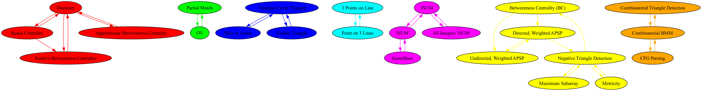

# Fine-grained analysis

### Source nodes in the SCC DAG
    - (OV, Partial Match)
    - (All-Integers 3SUM, 3SUM, 3SUM', GeomBase)
    - (Combinatorial BMM, CFG Parsing, Combinatorial Triangle Detection)
    - CNF-SAT
    - UOV
    - Matrix Product
    - Negative Triangle Search
    - Negative Triangle Listing
    - Minimum Witness Finding
    - All Pairs Minimum Witness (APMW)
    - Minimum Weight Triangle
    - Nondecreasing Triangle
    - $(\\min, \\leq)$ Product
    - Directed Radius
    - Undirected Radius
    - Directed Median
    - Undirected Median
    - Triangle Detection
    - MAX-CNF-SAT
    - OuMv
    - Triangle Collection*
    - k-Clique
    - k-SAT
    - Maximum Inner Product Search

### Longest shortest paths in the SCC DAG

Full view:

### Larger impact new edge

Currently we have 118 SCCs in the SCC DAG. 
Adding edge ('Second Shortest Simple Path' -> 'k-Clique') reduces the number of SCCs by 4. 
Resulting in 114 SCCs.

#### Current set of SCCs with more than 1 node

#### Adding edge ('Second Shortest Simple Path', 'k-Clique')

## Full version of original Graph 

## Full version of modified graph

