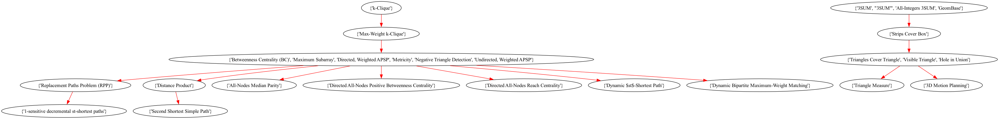
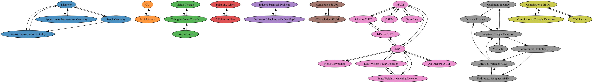

# Fine-grained analysis

## Source nodes in the SCC DAG
    - (OV, Partial Match)
    - (All-Integers 3SUM, 3SUM, 3SUM', GeomBase)
    - (Combinatorial BMM, CFG Parsing, Combinatorial Triangle Detection)
    - CNF-SAT
    - UOV
    - Matrix Product
    - Negative Triangle Search
    - Negative Triangle Listing
    - Minimum Witness Finding
    - All Pairs Minimum Witness (APMW)
    - Minimum Weight Triangle
    - Nondecreasing Triangle
    - $(\\min, \\leq)$ Product
    - Directed Radius
    - Undirected Radius
    - Directed Median
    - Undirected Median
    - Triangle Detection
    - MAX-CNF-SAT
    - OuMv
    - Triangle Collection*
    - k-Clique
    - k-SAT
    - Maximum Inner Product Search

## Longest shortest paths in the SCC DAG

## Highest impact edges
To see the full list:
- [highest impact edge by largest SCC](/impactful_edges_by_size): the filename start with the number of nodes in the largest SCC after adding the new edge
- [highest impact edge number of SCCs](/impactful_edges_by_num_sccs): the filename start with the number of SCCs after adding the new edge

### By largest SCC (Largest SCC: 12 | # of SCCs: 6)

### By number of SCC (Largest SCC: 6 | # of SCCs: 6)

### SCCs from the original graph
